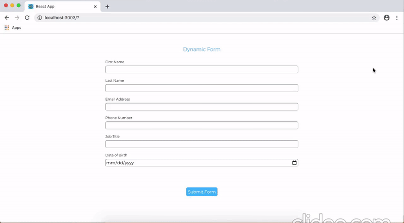

# dynamic-form
Creates form dynamically based on JSON data

# set up
- download the repo
- navigate to repo location, and run the following commands:
$ npm install
$ npm start

# notes
# implementation:
- I changed the code inside the "show_if" function to parse value for date before comparision
- I figured this is better than losing the generality of the form generator by adding specific checks elswhere
- I moved the evaluation function for parental consent outside just for clarity, object structure for the data remains unchanged
- App contains two react elements App && Form, on submission, data is sent back up to form and an alert is made in the browser         (alternatively saved in object, sent to db, etc..)
- Form Component maintains a state, while App does not.  

# UI/UX:
  -I went for uniformity in the look of the form fields
  -Some margin on the buttom of the page for familiarity
  -Relaxed font/color composition 
  
# future improvements:
  -improve input validation (e.g. default validation for email only checks if @ is present, but not if a domain name is in the text)
  -make input fields required based on JSON data
  -possibly add autocompletion for certain fields (e.g. job title)
 
# demo

